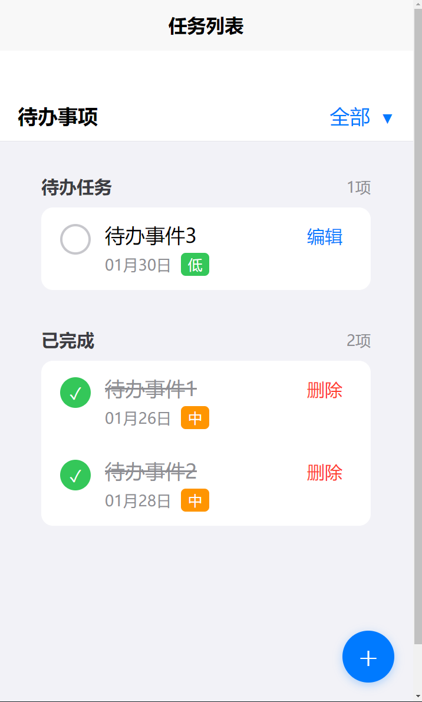
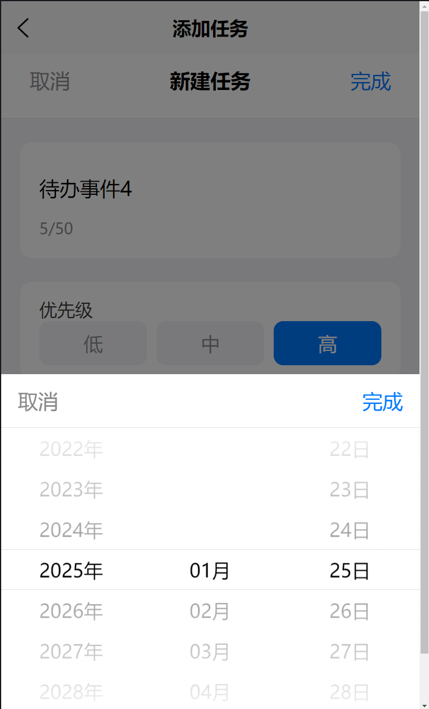

# iOS风格待办事项应用

一个基于 uni-app 开发的具有 iOS 风格的待办事项应用，支持多端运行。

## 功能预览

<div align="center">
    
    
</div>

## 功能特点

### 任务管理
- ✨ 创建、编辑、删除待办事项
- 📅 设置任务截止日期
- ⭐ 设置任务优先级
- ✅ 标记任务完成状态
- 📝 添加任务备注

### 智能分组
- 今日待办
- 待办任务
- 已完成任务

### 用户体验
- 💫 iOS风格界面设计
- 🌓 支持暗黑模式
- 📱 自适应布局，支持各种设备
- 🔍 任务筛选功能
- 💾 本地数据持久化

## 技术栈

- 框架：uni-app
- UI组件：uni-ui
- 存储：本地存储 (uni.storage)
- 样式：CSS3 + Flex布局

## 项目结构

```tree
├── components/          # 组件目录
│   ├── todoItemList.vue # 任务列表组件
│   └── ...
├── pages/              # 页面目录
│   ├── index/          # 主页
│   ├── addTodo/        # 添加任务页
│   └── todoItem/       # 任务详情页
├── static/             # 静态资源
├── utils/              # 工具函数
│   └── storage.js      # 存储相关
└── App.vue             # 应用入口
```

## 安装和运行

1. 克隆项目
```bash
git clone https://github.com/maile456/TodoList.git
```

2. 安装依赖
```bash
npm install
```

3. 运行项目
```bash
# 运行到H5
npm run dev:h5

# 运行到微信小程序
npm run dev:mp-weixin

# 运行到APP
npm run dev:app
```

## 使用说明

1. 添加任务
   - 点击右下角的"+"按钮创建新任务
   - 填写任务名称（必填）
   - 可选择设置截止日期和优先级
   - 可添加任务备注

2. 管理任务
   - 左滑任务可显示快捷操作
   - 点击任务可查看/编辑详情
   - 点击复选框可标记完成状态

3. 筛选任务
   - 点击顶部筛选按钮
   - 可选择查看全部/未完成/已完成任务

## 兼容性

- iOS 9.0+
- Android 5.0+
- 微信小程序
- H5

## 注意事项

- 首次使用需要授予相关权限
- 数据存储在本地，清除应用数据会导致任务丢失
- 建议定期备份重要数据

## 后续计划

- [ ] 添加数据云同步功能
- [ ] 支持任务分类管理
- [ ] 添加提醒功能
- [ ] 支持任务导入导出
- [ ] 优化性能和体验

## 贡献指南

欢迎提交 Issue 和 Pull Request

## 开源协议

MIT License
